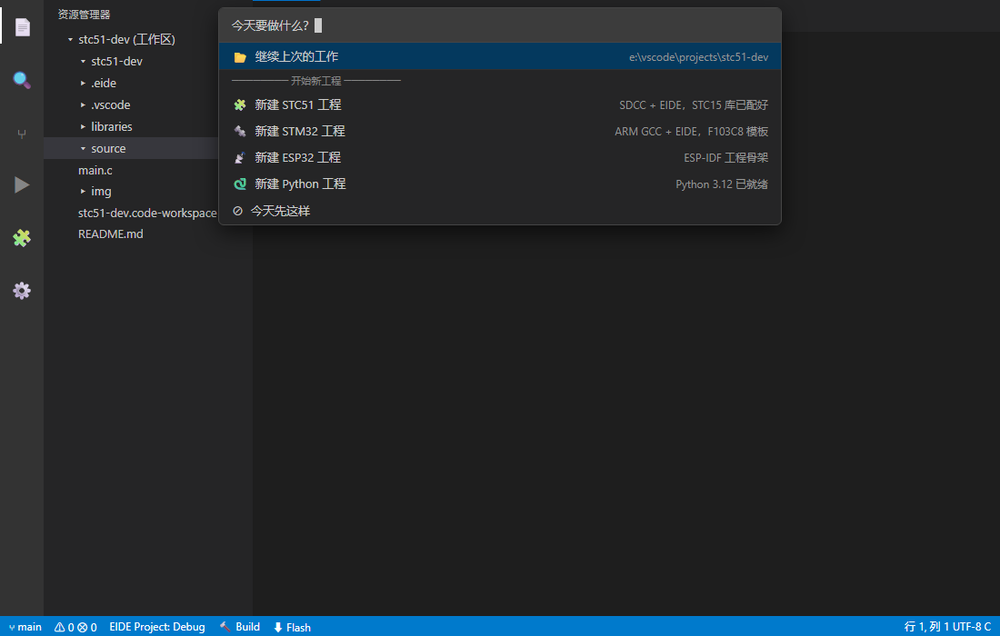
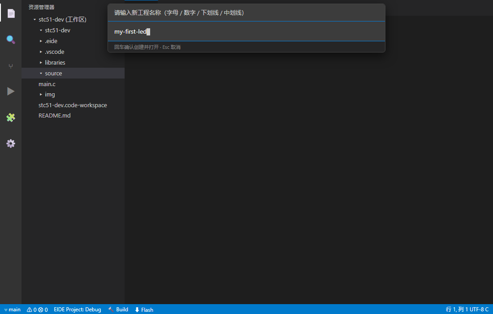

# Dev Wizard (开发向导)

   

一个 VS Code 启动向导：**每次打开 VSCode 都会问你"今天做什么？"**——回到上次的工作，
或从模板一键创建新工程（STC51 / STM32 / ESP32 / Python / C / C++ / 你自己的任意类型）。
配套的 `setup.ps1` 把 SDCC、ARM GCC、OpenOCD、Python 等工具链**全自动配好**，
让"新芯片的第一个工程"从半天环境配置变成一条命令。

> **今天要做什么？ What are we doing today?**
>
> 📂 继续上次的工作 / Continue last work
> ──── 开始新工程 / New project ────
> 🧩 新建 STC51 工程 … 🔩 STM32 … 📡 ESP32 … 🐍 Python … ✨ 你自己的任意类型
>
> *（不做出选择，向导就一直停留在屏幕上）*



## 目录 / Table of Contents

- [这个项目解决什么问题](#这个项目解决什么问题--the-problem)
- [服务对象](#服务对象--who-is-this-for)
- [**快速开始（从零到编译，推荐）**](#快速开始--从零到编译)
  - [第 0 步 安装前置软件](#第-0-步安装前置软件)
  - [第 1 步 拿到项目](#第-1-步拿到项目)
  - [第 2 步 运行一键配置脚本](#第-2-步运行一键配置脚本-setupps1)
  - [第 3 步 重启 VSCode](#第-3-步重启-vscode)
  - [第 4 步 首次使用向导](#第-4-步首次使用向导)
  - [第 5 步 编译你的第一个工程](#第-5-步编译你的第一个工程)
- [各工程类型使用指南](#各工程类型使用指南)
- [setup.ps1 到底做了什么](#setupps1-到底做了什么点开看明细)
- [手动安装（已有环境的用户）](#install--安装教程已有环境的用户)
- [配置参考](#configuration--配置)
- [编写自己的模板](#authoring-templates--编写模板)
- [常见问题 FAQ](#常见问题-faq)
- [故障排查](#遇到问题--troubleshooting)
- [卸载](#卸载--uninstall)

## 这个项目解决什么问题 / The problem

做嵌入式（或任何多语言）开发的人对这些场景一定不陌生：

- **环境配置是劝退第一步** 学 51 单片机想用 VSCode + SDCC 代替 Keil，
  得在网上翻半天教程：装编译器、配头文件路径、改链接参数……配完自己都
  记不清动过哪些地方，换台电脑全部重来
- **每换一种芯片就换一套 IDE** 51 用 Keil，STM32 用 CubeIDE，ESP32 又是
  ESP-IDF——快捷键、构建流程、烧录方式全都不一样
- **开新工程没有仪式感，全是体力活** 复制上一个工程 → 删旧代码 → 改工程
  名 → 改配置 → 祈祷还能编译

Dev Wizard 把这三件事全部自动化：

1. **`setup.ps1` 一键配环境**——工具链自动下载安装、模板自动生成、扩展自动
   装好、VSCode 配置自动写好（已有环境自动复用，不重复下载）
2. **向导一键建工程**——模板就是"一个能编译的完整工程"，选类型、起名字，
   复制-改名-打开一气呵成
3. **统一的开发体验**——所有芯片都在同一个编辑器里：同样的快捷键、同样的
   构建按钮（F7）、同样的产物目录

## 服务对象 / Who is this for

| 你是… | 你会得到… |
|---|---|
| **单片机初学者** | 跑一遍 `setup.ps1`，环境、模板、编译按钮全部就位。51/STM32 之旅从写代码开始，而不是从配环境开始 |
| **多平台嵌入式开发者** | STC51、STM32、ESP32 换着做？新工程零成本起步，工具链路径一次配好终身受用 |
| **老师 / 实验室管理员** | `setup.ps1` 幂等可重复执行，给整个机房统一部署开发环境就一行命令 |
| **任何 VSCode 重度用户** | 工程类型完全由你的模板目录决定——加一种语言/平台/框架，就是往文件夹里放一个目录 |

## 设计哲学 / Design notes

- **向导只是入口，模板才是资产** 扩展本体刻意保持两百行以内；每个模板
  是一个"能编译的完整工程"，沉淀的是工具链配置经验
- **模板即文件夹** 没有 DSL、没有构建步骤——放一个目录就能出现在向导里，
  分享模板 = 分享文件夹
- **零依赖** 纯 VSCode API，不拖 node_modules，clone 即源码，zip 即安装包

---

## 快速开始 / 从零到编译

> 适用：Windows 10/11，一台**什么开发环境都没装**的电脑。
> 全程约 10–20 分钟（视网速），总共下载约 310 MB，需要你动手的就 3 次。

### 第 0 步：安装前置软件

只需要两样，全部一路"下一步"即可：

1. **VSCode**（必需）
   - 官网下载：<https://code.visualstudio.com/>
   - ⚠️ 安装时请**勾选"添加到 PATH"**（"其他任务"页的第一个选项，默认已勾选，
     别取消）。脚本靠 `code` 命令安装扩展，没勾会报错。
2. **Git**（推荐，不是必需）
   - 官网下载：<https://git-scm.com/download/win>
   - 全部默认即可。Git 只是方便你克隆/更新本项目；
     不想装 Git？见[下一步的 ZIP 方式](#第-1-步拿到项目)。

> 已经装过 VSCode / Git？跳过本步，直接往下走。

### 第 1 步：拿到项目

**方式 A（推荐）：git clone**

打开"开始菜单 → Git → Git Bash"（或 PowerShell），逐行执行：

```bash
git clone https://github.com/linsea666/dev-wizard
cd dev-wizard
```

**方式 B：直接下载 ZIP（不想装 Git）**

打开 <https://github.com/linsea666/dev-wizard>，点绿色的 **Code** 按钮 →
**Download ZIP**，解压到任意位置（路径建议不要带中文和空格），
然后在解压出来的 `dev-wizard-main` 文件夹里打开终端继续。

### 第 2 步：运行一键配置脚本 setup.ps1

在本项目文件夹里打开 PowerShell（资源管理器地址栏输入 `powershell` 回车），
执行：

```powershell
powershell -ExecutionPolicy Bypass -File scripts/setup.ps1
```

> 为什么加 `-ExecutionPolicy Bypass`？Windows 默认禁止运行未签名的 ps1 脚本，
> 这个参数只对本次运行生效，不会改动你的系统安全策略。

脚本会问你一句话：

```
Tools install root [C:\dev]:
```

**工具链装哪里？直接回车 = 装到 `C:\dev`**；也可以输入别的位置，
比如 `D:\embedded`（路径不要带中文/空格）。随后全自动，无需值守：

```
[0/8] VS Code found.
[1/8] Tools: C:\dev  Templates: C:\dev\templates  Projects: C:\dev\projects
[2/8] Installing SDCC (+ runtime libraries) ...   ← 8051 编译器，~15 MB
[3/8] Installing Arm GNU Toolchain (xpack, ~250 MB) ...  ← STM32 编译器
[4/8] Installing OpenOCD (xpack) ...              ← 烧录/调试器，~30 MB
[5/8] Installing Python 3.12 (portable build) ...  ← 便携版，不碰系统 Python
[5/8] Installing stcgal (STC51 flashing tool) ...
[6/8] Generating template library ...
      template ready: stc51-base ... stm32-base ...
[7/8] Installing VS Code extensions ...
[8/8] Writing VS Code user settings ...
[8/8] Updating user PATH (python / sdcc) ...
=== DONE ===
```

- 某一步显示黄色 `skipped - re-run setup later`？**直接重新运行同一条命令**，
  脚本幂等：装好的自动跳过，只补缺的；下载支持断点续传。
- 全程只有一个交互（问安装路径），其余时间可以挂机。

### 第 3 步：重启 VSCode

**完全退出** VSCode（不是只关窗口：右下角托盘图标也退掉），再重新打开。
这样它才会读到新写入的配置和 PATH。

### 第 4 步：首次使用向导

启动后约 2.5 秒，向导自动弹出：


| 选项 | 行为 |
|---|---|
| **继续上次的工作** | 打开你上次用 VSCode 的工程（首次显示"暂无记录"） |
| **开始新工程（六种类型）** | 进入命名步骤，见下图 |
| **今天先这样 / Not today** | 关闭向导，本次不再打扰 |

选择"新建 STC51 工程"后，给工程起个名字（回车确认）：



- 命名规则：**字母 / 数字 / 下划线 / 中划线**，例如 `my-first-led`；
- 工程会创建到 `<安装位置>\projects\<工程名>\`（如 `C:\dev\projects\`），
  自动改好 EIDE 工程名、重命名工作区文件，然后**自动打开新窗口**进入工程。

几点向导行为说明：

- 按 `Esc` 或点开别处？向导会自动弹回来——**只有做出选择它才会消失**
  （这是刻意设计，不想看到就选"今天先这样"）；
- 想再次唤出：`Ctrl+Shift+P` → 输入 **what** → 选
  **Dev Wizard: what are we doing today?** 回车；
- 不想每次启动都弹：设置里把 `devWizard.showOnStartup` 改为 `false`。

### 第 5 步：编译你的第一个工程

新工程里已经放好一个可以直接编译的空白入口（STC51 是 `source/main.c`，
带 STC15 官方库）。打开工程后：

- **编译**：按 `F7`（或点底部状态栏的 **Build**），EIDE 开始构建，
  产物在工程的 `build\Debug\` 目录（51 工程是 `.hex`，STM32 是 `.elf/.hex`）；
- **改代码**：编辑 `source/main.c` 里 `while(1)` 中的内容，保存后再按 `F7`。

到这里，从零到编译的流程就完成了。往下看[各工程类型指南](#各工程类型使用指南)
了解烧录、调试和其余类型。

---

## 各工程类型使用指南

### 🔩 STC51（8051 / STC15 系列）

- **编译** `F7`：SDCC 编译，STC15 官方库已放进 `libraries/stc15_lib/`，
  头文件路径已配好，入口 `source/main.c`；
- **烧录**：先用 USB-TTL 串口板连接单片机（TXD→P3.0/RXD，RXD→P3.1/TXD，
  GND 共地），点状态栏 **Flash** 或 `Ctrl+Shift+B` 选 `flash` 任务。
  脚本底层用 [stcgal](https://github.com/grigorig/stcgal)（已自动装好）；
  stcgal 进入等待后，给单片机**断电再上电**即可进入 ISP 下载模式；
- **晶振频率**：模板默认按 16 MHz 配置（`.eide/stc.flash.json` 里的 `oscFreq`），
  与你板子不符就改这个值，否则串口波特率会不准；
- 换型号：`libraries/stc15_lib/config.h` 里选择芯片与主频。

### ⚡ STM32（F103 为例，标准库）

- **编译** `F7`：Arm GNU Toolchain 编译，CMSIS + 标准外设库已就位，
  链接脚本 `stm32f1x_64KB_flash.ld` 对应 64KB Flash 型号（C8T6）；
- **调试** `F5`：OpenOCD 已配好（`cortex-debug.openocdPath`），
  接上调试器（ST-Link/J-Link）直接按 `F5` 打断点、看变量；
- **烧录**：模板默认按 J-Link 配置；用 ST-Link 的同学可以直接 `F5` 借助
  OpenOCD 下载，或在 EIDE 的烧录配置里切换烧录器；
- 换容量型号：同时修改链接脚本里的 FLASH/RAM 大小与启动文件
  （`startup_stm32f10x_md.s` 对应中容量）。

### 📡 ESP32

向导创建的是 **ESP-IDF 工程骨架**（CMake 结构，`main/main.c` 入口）。
ESP-IDF 本身体积较大，setup 脚本不自动安装；请按
[ESP-IDF 扩展](https://marketplace.visualstudio.com/items?itemName=espressif.esp-idf-extension)
的引导安装框架（扩展内可设镜像加速），之后用扩展面板的 Build/Flash 按钮。

### 🐍 Python

便携版 Python 3.12 已装在 `<安装位置>\python312`（pip 已换清华源），
`python.defaultInterpreterPath` 已指向它——新建工程后 `main.py` 直接
`F5` 运行或点右上角运行按钮。不需要任何额外配置。

### ✨ C / C++

CMake 控制台工程骨架（`CMakeLists.txt` + `main.c/main.cpp`）。
需要本机有编译器，二选一：

- **MinGW-w64**（轻量）：用 [MSYS2](https://www.msys2.org/) 安装后把 `bin`
  加入 PATH；CMake Tools 会自动识别；
- **MSVC**（Visual Studio）：装 Visual Studio 勾选"使用 C++ 的桌面开发"，
  从"Developer PowerShell"启动 VSCode，CMake Tools 选择对应 kit。

---

## setup.ps1 到底做了什么？（点开看明细）

| 步骤 | 内容 | 下载源 | 大小 |
|---|---|---|---|
| 1 | 询问安装位置（默认 `C:\dev`，检测到已有安装可复用） | — | — |
| 2 | SDCC 4.x（8051 编译器）+ 自动补齐 MSYS2 运行库（否则裸机装完 sdcc 无法启动） | 清华 TUNA / MSYS2 源 | ~15 MB |
| 3 | Arm GNU Toolchain 13.2（STM32 编译器） | GitHub Release（ghfast.top 加速） | ~250 MB |
| 4 | OpenOCD 0.12（STM32 烧录调试） | GitHub Release（ghfast.top 加速） | ~30 MB |
| 5 | Python 3.12 + 清华 pip 源 + stcgal（STC51 烧录工具） | npmmirror 镜像 | ~28 MB |
| 6 | 生成模板库（自动替换路径占位符） | 本仓库 | — |
| 7 | 安装扩展：EIDE / Python / Cortex-Debug / CMake Tools / 本扩展 | VSCode 市场 | — |
| 8 | 合并写入 VSCode 用户设置（已有设置会先备份为 `settings.json.bak-setup`），并把 python / sdcc 加入用户 PATH | — | — |

- **幂等**：随时可重跑，已安装的工具自动跳过；下载中断重跑即可续上
- **不覆盖**：已有 VSCode 设置只会合并更新工具链路径，其他键原样保留；
  写入前自动备份为 `settings.json.bak-setup`
- **下载校验**：所有下载按文件头（magic bytes）校验，镜像返回错误页会被
  识别并自动重试，不会把坏文件当成下载成功
- **PATH**：把便携 Python、其 Scripts 目录（stcgal）、`sdcc\bin` 追加到
  **用户 PATH**（幂等，不重复添加；新开的终端/重启后的 VSCode 生效）
- **目录布局**：

```
C:\dev\
├── sdcc\                        ← 8051 编译器（含运行库，自包含）
├── xpack-arm-none-eabi-gcc-*\   ← STM32 编译器
├── xpack-openocd-*\             ← 调试/烧录
├── python312\                   ← 便携 Python + stcgal
├── templates\                   ← 生成的模板库（向导读这里）
└── projects\                    ← 新建工程的存放处
```

---

## Install / 安装教程（已有环境的用户）

> 如果你已经配好了各工具链，可以跳过 setup.ps1，手动安装扩展 +
> 指向自己的模板目录即可；无需编译、无需 node_modules，一分钟装好。

### 第 1 步：拿到 VSIX 安装包

**方式 A（推荐，直接下载）**：安装包就在本仓库里——
下载 [`dev-wizard-1.1.0.vsix`](https://github.com/linsea666/dev-wizard/raw/main/dev-wizard-1.1.0.vsix)。

> GitHub 直连慢？用加速链接下载：
> `https://ghfast.top/https://github.com/linsea666/dev-wizard/raw/main/dev-wizard-1.1.0.vsix`

**方式 B（从源码打包）**：

```powershell
git clone https://github.com/linsea666/dev-wizard.git
cd dev-wizard
powershell -ExecutionPolicy Bypass -File scripts/make-vsix.ps1
# 生成 dev-wizard-1.1.0.vsix
```

### 第 2 步：安装（二选一）

**图形界面**（鼠标点两下）：

1. 打开 VSCode → 左侧扩展面板（`Ctrl+Shift+X`）
2. 点面板标题栏右上角的 `···`
3. 选 **从 VSIX 安装...(Install from VSIX...)**
4. 选中下载好的 `.vsix` 文件

**命令行**：

```powershell
code --install-extension .\Downloads\dev-wizard-1.1.0.vsix
```

### 第 3 步：重启 VSCode

`Ctrl+Shift+P` → 输入 **Reload Window（重新加载窗口）** → 回车
启动后向导自动弹出。

### 第 4 步：告诉向导你的模板放在哪（首次使用必做）

向导的工程类型来自 `devWizard.templatesRoot` 指向的目录——**每个子文件夹就是一个工程类型**：

```jsonc
// VSCode 设置 (Ctrl+, 打开 settings.json)
{
    "devWizard.templatesRoot": "D:/my-templates",   // 你的模板库
    "devWizard.projectsRoot":  "D:/my-projects"     // 新工程的存放位置（可省略）
}
```

还没有模板？随便建个文件夹，往里放一个能编译/运行的小工程，再放一个可选的
`.wizard.json` 描述文件（详见下方 [Authoring templates](#authoring-templates--编写模板)），
它就会出现在向导里。

### 第 5 步：验证

重启后向导自动弹出，选择一种工程类型 → 输入工程名 → 自动创建并打开。
按 Esc 关掉向导？它会自动弹回来——**只有做出选择它才会消失**。
想再次唤出：`Ctrl+Shift+P` → **Dev Wizard: what are we doing today?**

---

## Configuration / 配置

| Setting | Default | Description |
|---|---|---|
| `devWizard.showOnStartup` | `true` | Show wizard on every VS Code start |
| `devWizard.projectsRoot` | same as templatesRoot | Where new projects are created |
| `devWizard.templatesRoot` | *(empty)* | Folder of project templates — **this is the only thing you must set** |

Example:

```json
{
    "devWizard.templatesRoot": "D:/my-templates",
    "devWizard.projectsRoot":  "D:/my-projects"
}
```

## Authoring templates / 编写模板

A template is just a folder inside `templatesRoot`:

```
my-templates/
├── stc51-base/          ← template = a complete project you can already build
│   ├── .wizard.json     ← (optional) how it appears in the wizard
│   ├── .eide/eide.yml
│   ├── source/main.c
│   └── ...
├── python-base/
│   ├── .wizard.json
│   └── main.py
└── anything-else/       ← no manifest? wizard shows the folder name
```

`.wizard.json` (all fields optional):

```json
{
    "label":       "新建 STC51 工程",     // list title
    "description": "SDCC + EIDE ...",     // list subtitle
    "icon":        "chip",                // any codicon name
    "open":        "workspace",           // "workspace" | "folder" (auto-detected if omitted)
    "replace": [                          // text replaced with the project name after copying
        { "files": ["CMakeLists.txt"], "find": "esp32-base" }
    ]
}
```

Automatic behaviour, no manifest needed:

- `.eide/eide.yml` (EIDE ≥ 3.27) or `.eide/eide.json` (older) → its `name`
  field is set to the project name
  ([EIDE](https://marketplace.visualstudio.com/items?itemName=cl.eide) embedded projects)
- a `*.code-workspace` in the template root is renamed to `<name>.code-workspace`
  and opened instead of the plain folder
- the template's `build/` output folder is stripped from the copy

### Toolchain path tokens / 工具链路径占位符

Templates that reference tools installed by `setup.ps1` should use **path tokens**
instead of absolute paths — `setup.ps1` replaces them with the real locations on
each machine (so the same template works everywhere):

| Token | Replaced with | Typical use |
|---|---|---|
| `__SDCC_ROOT__` | SDCC install root | EIDE `misc-controls` include/lib flags for 8051 |
| `__ARM_GCC_ROOT__` | Arm GNU Toolchain root | custom linker paths |
| `__OPENOCD_ROOT__` | OpenOCD root | debug scripts |

Example (from the bundled STC51 template, `.eide/eide.yml`):

```yaml
misc-controls: >-
  --iram-size 128 --xram-size 0 --code-size 4096
  -I__SDCC_ROOT__/share/sdcc/include
  -I__SDCC_ROOT__/share/sdcc/include/mcs51
  -L__SDCC_ROOT__/share/sdcc/lib/small
```

> Tokens are resolved when `setup.ps1` materializes the template library.
> On machines set up without the script, put the real paths in the template
> yourself (or run setup.ps1 pointing at your existing tools folder — it
> detects and reuses installed tools).

## Recommended companions / 推荐搭配

| Wizard type | Needs |
|---|---|
| STC51 | [EIDE](https://marketplace.visualstudio.com/items?itemName=cl.eide) + [SDCC](https://sdcc.sourceforge.net/) + stcgal（setup 自动装） |
| STM32 | EIDE + Arm GNU Toolchain + OpenOCD（或 ST-Link 工具） |
| ESP32 | [ESP-IDF extension](https://marketplace.visualstudio.com/items?itemName=espressif.esp-idf-extension) |
| Python | [Python extension](https://marketplace.visualstudio.com/items?itemName=ms-python.python) |
| C / C++ | [CMake Tools](https://marketplace.visualstudio.com/items?itemName=ms-vscode.cmake-tools) + MinGW 或 MSVC |

---

## 常见问题 FAQ

**Q：会动我已有的 VSCode 配置吗？**
不会覆盖。脚本只新增/更新工具链路径和向导相关键，其余原样保留；
写入前自动备份为 `settings.json.bak-setup`（在同目录，随时可还原）。

**Q：脚本可以重复运行吗？中途断网/关机了怎么办？**
可以、且鼓励。幂等设计：装好的自动跳过，下载断点续传，重跑同一条命令即可。

**Q：我系统里已经装过 Python / SDCC，会冲突吗？**
不会。全部工具装在独立目录（默认 `C:\dev`），便携 Python 不写注册表、
不影响系统版本；模板里写的是绝对路径，与你 PATH 里已有的工具互不干扰。

**Q：支持 macOS / Linux 吗？**
`setup.ps1` 仅支持 Windows 10/11。扩展本体是纯 VSCode API，跨平台——
mac/Linux 用户按[手动安装](#install--安装教程已有环境的用户)操作即可，
模板中的工具链路径自行填写。

**Q：向导按 Esc 关不掉？**
设计如此（避免"弹了一下就没"）。选"今天先这样"即可关闭本次；
或设置 `devWizard.showOnStartup: false` 彻底关闭开机弹出。

**Q：如何加一种新的工程类型（比如 Arduino、Rust）？**
往 `templatesRoot` 里放一个文件夹即可，无需改代码，见
[编写模板](#authoring-templates--编写模板)。

## 遇到问题？/ Troubleshooting

| 现象 | 处理 |
|---|---|
| 提示 `无法将"code"项识别为 cmdlet` | VSCode 未装或没勾"添加到 PATH"；重装 VSCode 勾选后重开终端 |
| 某步显示黄色 `skipped` / 某个工具下载失败 | **直接重跑 setup.ps1**——幂等设计，只补缺的（下载支持断点续传） |
| 提示 `downloaded file is not a valid archive` | 镜像临时返回了错误页，脚本已自动删除坏文件；稍后重跑即可 |
| SDCC 解压报 `extraction failed` | Windows 10 较老版本内置 tar 不支持 zstd；手动从 [TUNA](https://mirrors.tuna.tsinghua.edu.cn/msys2/mingw/mingw64/) 下载 sdcc 及 gcc-libs 等运行库包，用 [7-Zip](https://www.7-zip.org/) 解压到 `<安装位置>\sdcc` |
| 向导里列表为空 / 显示"未找到模板" | 检查设置 `devWizard.templatesRoot` 是否指向模板目录 |
| 新建工程后 EIDE 报找不到工具链 | 检查设置 `EIDE.SDCC.InstallDirectory` / `EIDE.ARM.GCC.InstallDirectory` 是否指向实际安装目录 |
| F5 调试报 OpenOCD 相关错误 | 检查设置 `cortex-debug.openocdPath`；确认调试器驱动已装（ST-Link 需装驱动） |
| 终端里 `python` / `stcgal` 不是内部命令 | PATH 是脚本新加的，**重开终端或重启 VSCode** 生效；或手动把 `<安装位置>\python312` 加入 PATH |
| 向导不自动弹出 | `Ctrl+Shift+P` → `Dev Wizard: what are we doing today?` 手动唤出；检查扩展是否已启用、`devWizard.showOnStartup` 是否为 `true` |
| stcgal 烧录一直 waiting / 失败 | 给单片机断电重新上电进入 ISP 模式；检查 TXD/RXD 是否接反、晶振频率 `oscFreq` 是否与板子一致 |
| 控制台窗口出现"选择"字样且停止滚动 | 不小心进入了标记模式：按 `Esc` 或回车恢复滚动 |

## 卸载 / Uninstall

1. **扩展**：VSCode 扩展面板找到 Dev Wizard → 卸载；
2. **工具链**：直接删除安装目录（默认 `C:\dev`），便携工具无残留；
3. **设置**：`settings.json` 里删除 `devWizard.*`、`EIDE.*`、
   `cortex-debug.openocdPath`、`python.defaultInterpreterPath` 中不需要的键
   （或还原 `settings.json.bak-setup` 备份）；
4. **PATH**：系统设置 → 环境变量 → 用户变量 Path，删除对应的三条
   （`...\python312`、`...\python312\Scripts`、`...\sdcc\bin`）。

## License / 许可证

[MIT](LICENSE)
